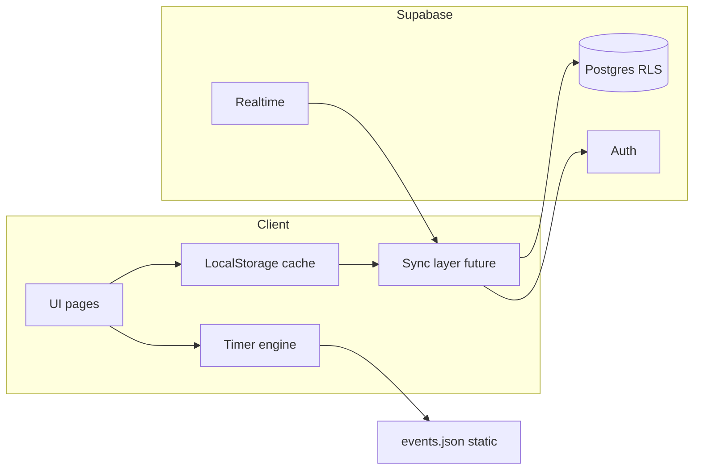

# SUPABASE_SYNC_ANALYSIS — AATIMER / timer-site

Документ подготовлен для будущей синхронизации пользовательских данных через Supabase.  
**Код сайта в этом этапе не изменялся.** Страница «Трекер задач» не реализована — учтена только в модели данных.

---

## 1. Анализ текущего LocalStorage

### 1.1. Какие хранилища используются

| Механизм | Используется? | Где |
|----------|---------------|-----|
| **localStorage** | Да | [`js/storage.js`](js/storage.js), вызывается из [`js/timers.js`](js/timers.js) |
| **sessionStorage** | Нет | — |
| **cookies** | Нет | — |
| **IndexedDB** | Нет | — |
| **Cache API (Service Worker)** | Да, но не user-data | [`sw.js`](sw.js) — кеш статики и `data/events.json` |
| **In-memory (JS)** | Да | `notifiedEvents`, `audioCtx` в `timers.js` — не переживают перезагрузку |

Единственный модуль персистентности пользователя сейчас — [`js/storage.js`](js/storage.js).

### 1.2. Полный список ключей LocalStorage

| Ключ | Тип значения | Пример | Назначение |
|------|--------------|--------|------------|
| `eventsNotify` | строка | `"true"` / `"false"` | Глобально включены browser-уведомления о событиях |
| `eventsNotifyMinutes` | строка (число) | `"5"`, `"10"`, `"15"` | За сколько минут до старта срабатывает будильник |
| `eventsSubscribed` | JSON-объект | `{ "28": true, "11": true }` | Подписки/будильники по `id` события из каталога |
| `eventsCollapsed` | JSON-объект | `{ "battle": true }` | Какие категории на странице таймеров свёрнуты |

Ключи совместимы со старым PHP-сайтом (миграция prefs в том же браузере).

### 1.3. Где читается / пишется

| Данные | Чтение | Запись |
|--------|--------|--------|
| `eventsNotify` | старт `timers.js`, `updateNotifyButton` | `toggleNotifications()` |
| `eventsNotifyMinutes` | старт + `<select id="notifyMinutes">` | `change` на select → `setNotifyMinutes` |
| `eventsSubscribed` | старт, `updateAlarmButtons`, `checkNotification` | `toggleEventAlarm()` → `toggleSubscription` |
| `eventsCollapsed` | старт / `renderEvents` | `toggleCategory()` |

Каталог событий **не** хранится в LocalStorage: загружается из [`data/events.json`](data/events.json) через `fetch` в [`js/app.js`](js/app.js).

### 1.4. Что не является пользовательскими данными

- Расписание и метаданные событий (`events.json`) — контент сайта, обновляется деплоем.
- Кеш Service Worker — офлайн-оболочка, не синхронизируется между устройствами.
- Разрешение `Notification.permission` — состояние браузера, не БД.

---

## 2. Список всех пользовательских данных (текущие + будущие)

### 2.1. Текущие (уже в браузере)

| ID данных | Что хранится | Зачем | Sync после auth? | Только локально? | Форма в Supabase |
|-----------|--------------|-------|------------------|------------------|------------------|
| A1 | Флаг уведомлений | Вкл/выкл будильников | **Да** | Нет | `user_settings.notifications_enabled` |
| A2 | Минуты до уведомления | Lead time 5/10/15 | **Да** | Нет | `user_settings.notify_minutes` |
| A3 | Подписки на события | На какие `event_id` звонит будильник | **Да** | Нет | таблица `user_alarms` (по строке на событие) |
| A4 | Свёрнутые категории | UX таймеров | **Да** (UI prefs) | Можно оставить локально, но для единого UX на устройствах — sync | `user_settings.collapsed_categories` (JSONB) |

### 2.2. Эфемерные (не синхронизировать)

| ID | Что | Почему локально |
|----|-----|-----------------|
| E1 | `notifiedEvents` (Set) | Антидубликат «уже уведомили в эту минуту» |
| E2 | `AudioContext` | Сессия вкладки |
| E3 | Cache SW | Технический кеш |
| E4 | `Notification.permission` | Системное API браузера |

### 2.3. Будущие (трекер задач)

| ID | Что | Sync? | Supabase |
|----|-----|-------|----------|
| T1 | Списки задач | Да | `task_lists` |
| T2 | Задачи (title, completed, …) | Да | `tasks` |
| T3 | Связь с событием (`event_id`, `event_time`) | Да (поля задачи) | колонки в `tasks` |
| T4 | Кастомные задачи без события | Да | `tasks` с `event_id = null` |

### 2.4. Данные, связанные с таймерами (детализация)

| Тема | Сейчас | Sync? | Комментарий |
|------|--------|-------|-------------|
| Выбранные события (будильники) | `eventsSubscribed` | **Да** | = `user_alarms` |
| Подписки на события | то же | **Да** | отдельной таблицы `selected_events` не нужно |
| Будильники | то же + звук/Notification на клиенте | **Да** (факт подписки) | срабатывание — только на клиенте при открытом сайте/PWA |
| Настройки уведомлений | `eventsNotify` | **Да** | |
| Минуты до уведомления | `eventsNotifyMinutes` | **Да** | |
| Фильтры | нет отдельного ключа | — | категории сейчас только collapse; будущие фильтры → `user_settings.filters` JSONB |
| Свёрнутые категории | `eventsCollapsed` | **Да** (рекомендуется) | |
| Настройки интерфейса | collapse + будущие | **Да** | всё в `user_settings` |
| Маршрут планировщика | не сохраняется | опционально позже | если понадобится — `user_settings.last_route_event_ids` или отдельная таблица |

---

## 3. Что нужно синхронизировать

После авторизации между устройствами синхронизируются:

1. **Будильники / подписки** (`user_alarms`)
2. **Настройки уведомлений** (enabled + minutes)
3. **UI-настройки** (collapsed categories; позже фильтры)
4. **Списки задач** (`task_lists`)
5. **Задачи и статусы выполнения** (`tasks`)

Паттерн записи:

```
Гость:     UI → LocalStorage
Auth:      UI → LocalStorage → upsert Supabase
           (+ Realtime → LocalStorage → UI на других клиентах)
```

---

## 4. Что должно оставаться только локально

| Данные | Причина |
|--------|---------|
| Антиспам уведомлений (`notifiedEvents`) | Сессионная логика |
| Состояние Audio / модалок | UI session |
| Cache API / SW | Офлайн-ассеты |
| Permission Notification | Не контролируется приложением полностью |
| Каталог `events.json` | Общий контент, не user-row |
| Расчёт next event / countdown / timeline / route | Клиентская игровая логика, не сервер |

**Supabase не считает таймеры** и не хранит «текущий remainingMs».

---

## 5. Учёт будущего трекера задач

### 5.1. Принцип: задача не зависит от «живого» таймера

Задача — самостоятельная сущность. Связь с событием **опциональна**.

```
Задача
├── id
├── title
├── completed
├── event_id      (может быть null)
├── event_time    (может быть null; снимок конкретного слота)
└── updated_at
```

Пример:

- «Сходить на Мирового босса» → `event_id = 28` (Анталлон), `event_time = 2026-09-14T21:30:00+03:00`
- «Купить зелья» → `event_id = null`, `event_time = null`

### 5.2. Что хранить в задаче vs что брать из таймеров

| Поле / данные | Где хранить | Почему |
|---------------|-------------|--------|
| `title` | в задаче | Пользователь может переименовать; событие могут удалить из каталога |
| `completed` | в задаче | Пользовательский статус |
| `event_id` | в задаче (nullable) | Слабая связь с каталогом `events.json` (не FK Postgres) |
| `event_time` | в задаче (nullable) | Снимок «на это вхождение»; не ломается при смене schedule |
| Название из каталога «сейчас» | опционально с клиента | Join по `event_id` → `events.json` для подсказки |
| Следующее ближайшее время | **только клиент**, по `event_id` + schedule | Пересчитывается; не писать в БД как единственный источник |
| Countdown | клиент | |
| Описание/награды события | из каталога по желанию | Не дублировать обязательно в задаче |

Если расписание события изменилось или наступило следующее вхождение:

- snapshot `event_time` остаётся историей «под что создали задачу»;
- UI может **дополнительно** показать «следующее по расписанию» через таймерный модуль;
- задача не становится невалидной, если `event_id` исчез из каталога — остаются `title` и `event_time`.

### 5.3. Создание задачи из таймера (будущий UX)

1. Пользователь на странице таймеров выбирает событие.
2. Клиент создаёт задачу: `title = event.name`, `event_id = event.id`, `event_time =` выбранный/ближайший слот (ISO).
3. Сохранение: LocalStorage (очередь) → Supabase `tasks`.
4. На странице трекера задача отображается автономно; таймерные виджеты — enrichment.

### 5.4. Списки задач

Минимум один список по умолчанию на пользователя (`task_lists`), задачи ссылаются через `list_id`.  
Позже: несколько списков, сортировка, архив.

---

## 6. Рекомендуемая архитектура Supabase

### 6.1. Роли слоёв



- **Клиент:** таймеры, next event, хронология, фильтры, маршруты, UI, локальный кэш.
- **Supabase:** auth, хранение user-data, sync, Realtime, RLS.
- **Статика:** каталог событий (GitHub Pages).

### 6.2. Режимы пользователя

| Режим | Хранение | Sync |
|-------|----------|------|
| Гость | только LocalStorage | нет |
| Авторизованный | LocalStorage + Supabase | local-first, затем upsert; Realtime внутрь |

### 6.3. Стратегия конфликтов (простая и надёжная)

1. **Каждый объект — отдельная строка** с UUID (`tasks`, `user_alarms`, `task_lists`). Не хранить все будильники/задачи одним большим JSON в одной строке (кроме компактных UI prefs вроде `collapsed_categories`).
2. **Last-Write-Wins (LWW)** по полю `updated_at` (timestamptz, клиент ставит `now()` при каждом изменении; сервер может `GREATEST` при upsert).
3. **Soft delete:** `deleted_at` — чтобы удаление на одном устройстве побеждало устаревший update на другом (правило: если `deleted_at` новее — считать удалённым).
4. **Точечный sync:** upsert/delete по `id`, не полная перезапись всей коллекции без сравнения.
5. При равном `updated_at` (редко): побеждает больший `id` (UUID lexical) или явный `version` integer (+1 на запись) — в схеме заложен `updated_at` + опционально `version`.

**Пример конфликта ПК vs телефон:** оба правят одну задачу → клиент B получает Realtime/pull, сравнивает `updated_at`, применяет более новый snapshot строки целиком (LWW на уровне row).

### 6.4. Guest → Auth merge (первый вход)

1. Прочитать локальные alarms/settings/(future tasks).
2. Загрузить облачные строки пользователя.
3. Merge по ключу:
   - alarms: по `event_id` — union (включённое на любом устройстве → enabled), LWW по `updated_at` если оба есть;
   - settings: LWW по `updated_at` всей строки settings **или** field-level: для скаляров брать более новый `user_settings.updated_at`;
   - tasks: по UUID; гостевые задачи без id в облаке — insert с новыми UUID.
4. Записать результат локально и upsert в облако.
5. Пометить merge выполненным (`profiles.guest_merged_at`), чтобы не дублировать.

---

## 7. Предлагаемые таблицы и поля

### 7.1. `profiles`

| | |
|--|--|
| **Назначение** | Профиль = пользователь Auth |
| **PK** | `id uuid` (= `auth.users.id`) |
| **FK** | `id` → `auth.users(id)` ON DELETE CASCADE |
| **Связь с user** | 1:1 |

| Поле | Тип | Описание |
|------|-----|----------|
| `id` | uuid PK | = auth user |
| `display_name` | text null | |
| `created_at` | timestamptz | |
| `updated_at` | timestamptz | конфликт LWW профиля |
| `guest_merged_at` | timestamptz null | флаг merge локальных данных |

- **Sync:** да (профиль)
- **Realtime:** желательно
- **Конфликты:** `updated_at`

### 7.2. `user_settings`

| | |
|--|--|
| **Назначение** | Настройки уведомлений и UI (1 строка на user) |
| **PK** | `user_id uuid` |
| **FK** | `user_id` → `profiles(id)` |

| Поле | Тип | Описание |
|------|-----|----------|
| `user_id` | uuid PK | |
| `notifications_enabled` | boolean | ← `eventsNotify` |
| `notify_minutes` | int | ← `eventsNotifyMinutes` (check 1..120) |
| `collapsed_categories` | jsonb | ← `eventsCollapsed`, default `{}` |
| `filters` | jsonb | резерв будущих фильтров, default `{}` |
| `updated_at` | timestamptz | LWW |

- **Sync:** да
- **Realtime:** да
- **Конфликты:** LWW всей строки по `updated_at` (настройки меняются редко)

Отдельная таблица `selected_events` **не нужна**: выбор для будильника = `user_alarms`.

### 7.3. `user_alarms`

| | |
|--|--|
| **Назначение** | Подписка/будильник на игровое событие |
| **PK** | `id uuid` |
| **Unique** | `(user_id, event_id)` |
| **FK** | `user_id` → `profiles(id)` |
| **Связь с каталогом** | `event_id` text/int — **логический** id из `events.json`, без FK |

| Поле | Тип | Описание |
|------|-----|----------|
| `id` | uuid PK | |
| `user_id` | uuid | |
| `event_id` | text | строка `"28"` и т.п. (стабильнее text при смене типов) |
| `enabled` | boolean | default true |
| `created_at` | timestamptz | |
| `updated_at` | timestamptz | LWW |
| `deleted_at` | timestamptz null | soft delete |

Маппинг из текущего LocalStorage:

```json
{ "28": true, "11": true }
→
rows (event_id=28, enabled=true), (event_id=11, enabled=true)
```

- **Sync:** да
- **Realtime:** да
- **Конфликты:** LWW по `(user_id, event_id)` / `id` + `updated_at`; soft delete

### 7.4. `task_lists`

| | |
|--|--|
| **Назначение** | Пользовательские списки задач |
| **PK** | `id uuid` |
| **FK** | `user_id` → `profiles(id)` |

| Поле | Тип | Описание |
|------|-----|----------|
| `id` | uuid PK | |
| `user_id` | uuid | |
| `title` | text | например «Основной» |
| `sort_order` | int | |
| `created_at` | timestamptz | |
| `updated_at` | timestamptz | |
| `deleted_at` | timestamptz null | |

- **Sync / Realtime / конфликты:** да / да / LWW + soft delete

### 7.5. `tasks`

| | |
|--|--|
| **Назначение** | Задачи трекера (с событием или без) |
| **PK** | `id uuid` |
| **FK** | `user_id` → `profiles`; `list_id` → `task_lists(id)` nullable |

| Поле | Тип | Описание |
|------|-----|----------|
| `id` | uuid PK | |
| `user_id` | uuid | |
| `list_id` | uuid null | |
| `title` | text | обязательный заголовок |
| `completed` | boolean | default false |
| `event_id` | text null | связь с каталогом таймеров |
| `event_time` | timestamptz null | снимок конкретного времени слота |
| `notes` | text null | |
| `sort_order` | int | |
| `created_at` | timestamptz | |
| `updated_at` | timestamptz | LWW |
| `deleted_at` | timestamptz null | |
| `version` | int | optional optimistic (+1) |

- **Sync:** да (все пользовательские поля)
- **Realtime:** да
- **Конфликты:** LWW по `updated_at` (и/или `version`); soft delete

### 7.6. RLS (принцип)

На всех user-таблицах:

```sql
-- пример политики
using (auth.uid() = user_id)
with check (auth.uid() = user_id);
```

`profiles`: `auth.uid() = id`.

### 7.7. Realtime

Включить publication для: `user_settings`, `user_alarms`, `task_lists`, `tasks` (и при необходимости `profiles`).  
Клиент фильтрует по `user_id = auth.uid()` (Supabase Realtime + RLS).

### 7.8. Что не кладём в Supabase

| Данные | Где живут |
|--------|-----------|
| Schedule, name, icon, category событий | `data/events.json` |
| Расчёт next/remaining | клиент `timers.js` |
| Звук будильника | клиент |

---

## 8. План интеграции с текущим сайтом

Без реализации сейчас — рекомендуемый порядок:

### Этап 0 — Документ (этот файл)
Модель данных и границы ответственности зафиксированы.

### Этап 1 — Слой хранилища (рефакторинг без UX-лома)
- Расширить абстракцию над текущим `storage.js` (например `UserDataStore`): get/set alarms, settings.
- Сохранить те же ключи LocalStorage для гостей и обратной совместимости.
- Таймерная логика не трогается.

### Этап 2 — Supabase Auth
- Email/OAuth, сессия на клиенте.
- Создание `profiles` + дефолтный `user_settings` + дефолтный `task_lists` (trigger на signup).

### Этап 3 — Sync alarms + settings
- При изменении будильника/настроек: local write → debounce upsert.
- При логине: pull + guest merge.
- Маппинг `eventsSubscribed` ↔ `user_alarms`.

### Этап 4 — Страница «Трекер задач»
- Новая статическая страница (например `tasks.html`).
- CRUD через тот же sync-слой → `tasks` / `task_lists`.
- Кнопка «Добавить в задачи» на таймерах: создать task с `event_id` + `event_time`.

### Этап 5 — Realtime
- Подписка на изменения строк пользователя; применение LWW к локальному кэшу и UI.

### Этап 6 — Полировка
- Индикатор sync/offline, очередь офлайн-мутаций (IndexedDB optional), обработка удаления событий из каталога.

**Важно:** расчёты таймеров, хронология, маршруты остаются в клиенте. Supabase не становится игровым бэкендом.

---

## 9. Возможные проблемы и риски

| Риск | Суть | Митигация |
|------|------|-----------|
| iOS / фон | Будильник не звонит при закрытом Safari/PWA | Документировать ограничение; позже Push (отдельный этап) |
| Смена `event_id` в каталоге | Старые alarms/tasks ссылаются на несуществующий id | Хранить `title` в задаче; alarms показывать «событие удалено» |
| Clock skew LWW | Кривые часы устройства | Server `updated_at` через `now()` в RPC/trigger при желании; или `version` |
| Двойной merge гостя | Повторный import локальных данных | `profiles.guest_merged_at` |
| Большой JSON settings | Конфликт «двух полей сразу» | Редко; при росте — разнести критичные поля или field-level merge |
| GH Pages + Auth | SPA redirect URL, PKCE | Настроить Site URL / redirect в Supabase; относительные пути |
| SW кеш старого JS | Пользователь не видит sync | bump `CACHE` version при релизах |
| Privacy | User data в облаке | RLS; минимум PII в `profiles` |

---

## Приложение A — Быстрый чеклист «sync vs local»

| Данные | Sync |
|--------|------|
| Будильники / подписки | Да |
| notify on/off + minutes | Да |
| collapsed categories | Да |
| tasks / lists / completed | Да |
| events.json catalog | Нет (статика) |
| countdown / next event calc | Нет (клиент) |
| notifiedEvents / audio | Нет (ephemeral) |
| SW cache | Нет |

## Приложение B — Соответствие старых ключей → таблицы

| LocalStorage | Supabase |
|--------------|----------|
| `eventsNotify` | `user_settings.notifications_enabled` |
| `eventsNotifyMinutes` | `user_settings.notify_minutes` |
| `eventsSubscribed` | `user_alarms` (N строк) |
| `eventsCollapsed` | `user_settings.collapsed_categories` |

---

*Конец документа. Реализация кода и создание проекта Supabase — отдельные этапы.*
